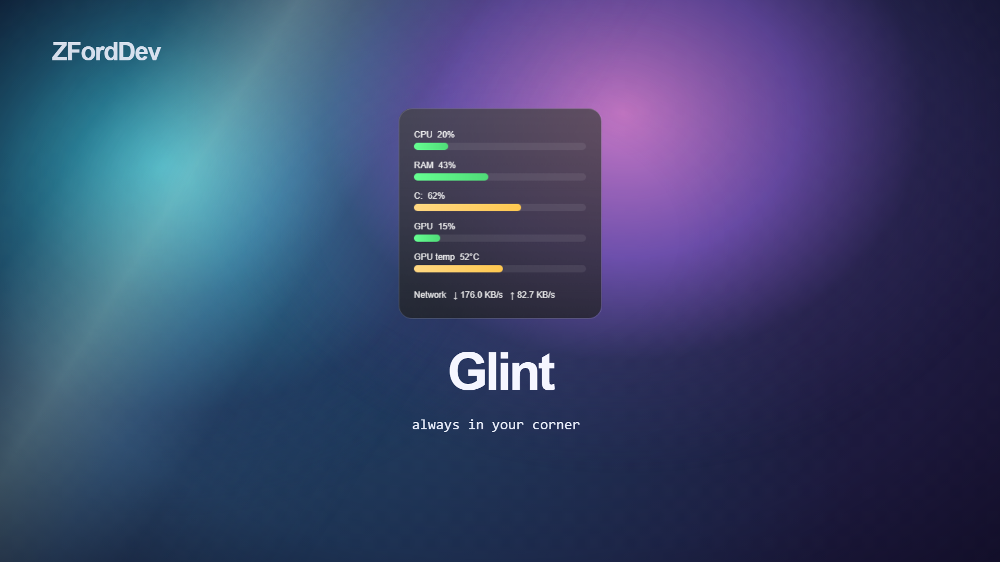
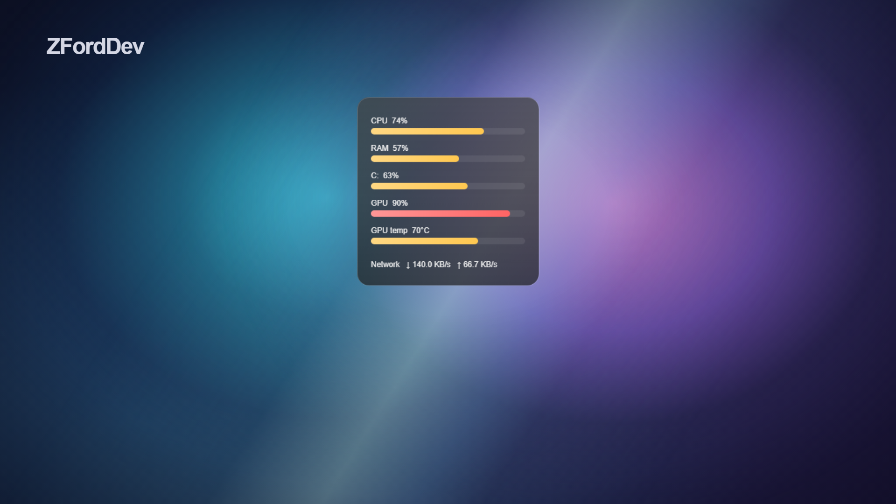

<div align="center">


# Glint

## 🌟 always in your corner 🌟

[Documentation](https://docs.zford.dev/zforddev/glint/) · [Downloads](https://github.com/ZFordDev/Glint/releases/latest) · [Report a bug](https://github.com/ZFordDev/Glint/issues/new)

[](https://github.com/ZFordDev/Glint/releases/latest)
[](https://github.com/ZFordDev/Glint/actions/workflows/python-app.yml)

[](LICENSE)

</div>

Glint keeps an eye on your system and stays out of your way.

CPU, RAM, storage, GPU, temperatures and network activity live in a small,
translucent HUD on your desktop. Drag it where you want it, choose a look that
fits your desktop, and get back to what you were doing.

## See Glint in action

<p align="center">
  
  
</p>

<p align="center">
  <a href="https://www.youtube.com/watch?v=dZeHdq73dP4">
    
  </a>
  <br>
  <sub>▶️ <i>Watch Glint in action</i></sub>
</p>

## What Glint does

- Keeps CPU, RAM, storage and network activity visible at a glance
- Shows GPU usage and temperatures when your system exposes them
- Sits quietly on your desktop in a small, frameless HUD
- Lets you adjust the theme, opacity and refresh rate
- Remembers where you put it
- Lives in the system tray when you need it
- Can start automatically with Windows, macOS or Linux
- Runs as a standalone app - no Python installation required

## Download

Grab the archive for your system from the [latest GitHub Release](https://github.com/ZFordDev/Glint/releases/latest):

| Platform | Release asset |
| --- | --- |
| Windows x86-64 | `glint-windows-x86_64.zip` |
| macOS Apple silicon | `glint-macos-arm64.zip` |
| macOS Intel | `glint-macos-x86_64.zip` |
| Linux x86-64 | `glint-linux-x86_64.tar.gz` |

Download, extract and launch Glint. No installer or Python setup required.

On Windows, launch `Glint.exe`. On macOS and Linux, launch `Glint`. Release checksums are published in `SHA256SUMS`.

> [!NOTE]
> Glint's standalone archives are currently unsigned. Windows SmartScreen or macOS Gatekeeper may ask you to confirm that you trust the download. Official builds are published through this repository's GitHub Releases.

## Use Glint

| Action | Result |
| --- | --- |
| Left-click and drag the HUD | Move Glint - it'll remember where you left it |
| Right-click the HUD | Open Settings or exit Glint |
| Double-click the tray icon | Show and raise the HUD |
| Open the tray menu | Show Glint, open Settings, manage autostart, or exit |

Settings and layouts are stored in your operating system's application configuration directory.

Want to make Glint a little more your own? The generated `default_layout.json` can be edited to change the HUD size, widget order, positions and disk selection.

See the [Glint documentation](https://docs.zford.dev/zforddev/glint/) for examples and platform-specific notes.

## Your computer. Your data.

Glint runs locally.

There are no accounts, analytics, telemetry, advertising or cloud services. Your system readings are displayed on your computer and are not written to a monitoring history or transmitted anywhere.

Only your preferences, HUD position and layout files are saved on your device.

You can read the full [privacy statement](PRIVACY.md) if you'd like the details.

## Sensor support

Not every operating system or piece of hardware exposes the same sensors. Glint uses the information your system makes available and shows unavailable readings as such.

| Metric | Windows | macOS | Linux |
| --- | --- | --- | --- |
| CPU, RAM, disk, network | `psutil` | `psutil` | `psutil` |
| CPU temperature | WMI when exposed | `psutil` when exposed | hwmon through `psutil` |
| NVIDIA GPU usage and temperature | `nvidia-smi` | `nvidia-smi` when supported | `nvidia-smi` |
| AMD/Intel GPU usage | Windows performance counters | Unavailable fallback | Unavailable fallback |
| Other GPU temperatures | Platform sensor when exposed | Platform sensor when exposed | hwmon when exposed |

Temperature and GPU availability varies by hardware, drivers, permissions and operating system.

Wayland compositors may also prevent applications from forcing the HUD below other windows. Glint remains frameless and usable when that hint is ignored.

## Run from source

Want to poke around under the hood?

Glint requires Python 3.10 or later and a graphical desktop session.

```bash
git clone https://github.com/ZFordDev/Glint.git
cd Glint
python -m venv .venv

# Windows
.venv\Scripts\activate

# macOS/Linux
source .venv/bin/activate

python -m pip install .
glint
```

For development:

```bash
python -m pip install -e ".[dev]"
ruff format --check .
ruff check .
python -m pytest
python main.py
```

The test workflow runs on Windows, macOS and Linux for every pull request and push to `main`.

## Project status

Glint is stable and ready for everyday use on Windows, macOS and Linux.

The project is intentionally kept simple. There are no accounts, background services or built-in updater to maintain. When a new version is available, you can grab it from the latest GitHub Release.

Every release is built and tested through GitHub Actions across Windows and Linux, with formatting, linting, tests and version checks completed before the release archives are created.

Want to know how Glint is put together? The [architecture and maintenance notes](https://docs.zford.dev/zforddev/glint/maintenance/) go into the nerdier details.

## Contributing and support

Found a bug, have an idea, or want to contribute?

- Read [CONTRIBUTING.md](CONTRIBUTING.md) before preparing a change
- Use the [issue tracker](https://github.com/ZFordDev/Glint/issues) for reproducible bugs and focused feature requests
- Report vulnerabilities privately using [SECURITY.md](SECURITY.md)
- See what's changed between versions in the [changelog](CHANGELOG.md)

## License

Glint is open-source software released under the [MIT License](LICENSE).

Use it, learn from it, modify it or build something of your own with it.